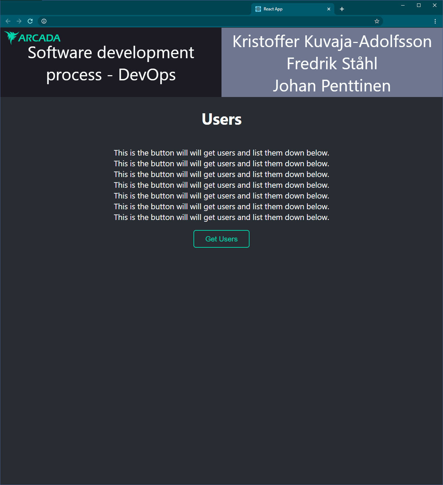

# Arcada DevOps 2020 Project
*With Kristoffer, Fredrik and Johan*  
  
  
This project is built in React and uses AWS S3 bucket to collect information that is then displayed within the application.

## Installation
Clone and *(change directory then)* setup with npm install, run with npm start`
```
git clone https://github.com/penttinj/arcada-devops-project.git
cd /arcada-devops-project
npm install
npm start
```

## Preview
<!---

Changed to img tag for size
--->


## Contribution
Create a new branch, add your changes, commit with an appropriate message.

Make a new pull request.

Have you changes previewed by members of the collaboration.

  
###### Their judgement is absolute!

If your changes are approved and successfully run through our unit tests your changes will be incorporated into the project.

You can follow the codebuild through our aws cloudwatch and see responses in real time over on our discord with the help of our sophisticated SNS functionality.


